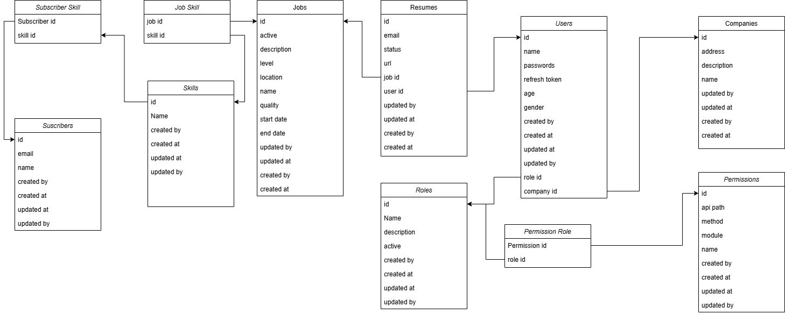

# JobHunter - Job Search Platform

## Introduction
**JobHunter** is a job-hunting web application designed with **Domain-Driven Design (DDD)** principles. The project simulates a real-world job portal, built using **Java Spring Boot (v3.2.4)** and **MySQL** for database storage, with **Spring Security (v2.5.7)** for authentication and authorization.

## Features
- **User Authentication & Management**:
  - Login and account creation
  - Role-based user management (Recruiters, Job Seekers)
  - Permissions for CRUD operations
- **Job Filtering**:
  - Search jobs based on criteria (salary, company, etc.)
- **Security & Authorization**:
  - OAuth 2.0-based authentication
  - JWT token-based authorization
  - Refresh token implementation
- **API Management**:
  - Global and local exception handling
  - API versioning support
  - Pagination & filtering for database queries
- **Email Notification System**:
  - Email service setup using Spring Email
- **Cron Job (exploration)**:
  - Cron multiple job from resources

---

## **Global API Response Format**
The project ensures structured API responses using a standardized response entity format.

## **Exception Handling**
- **Local Exception Handling**: Handled within the same file using `@ExceptionHandler`.
- **Global Exception Handling**: Managed via `@ControllerAdvice`.
- **Error Formatting**: Structured REST responses in `util.error`.

---

## **Authentication & Security**

### **OAuth 2.0 with JWT Authentication**
- **JWT Token Structure**: Header, Payload, Signature
- **Token Storage**: Saved securely in `SecurityContext`
- **Excluded Routes**: `login`, `create account`

### **Authentication Flow**
1. **User Input Validation**
   - Validate request payload (e.g., username, password)
   - Reference: [ResLoginDTO.java](https://github.com/phucpham24/RESTFull_java/blob/master/src/main/java/vn/backend/jobhunter/domain/response/ResLoginDTO.java)
2. **User Authentication**
   - Fetch user from the database
   - Verify hashed password using **BCryptPasswordEncoder**
3. **JWT Token Generation**
   - Secure key (`HS256`) stored in environment variables
   - Expiry: **1 day**
   - User roles & claims included
4. **User Response**
   - Password excluded from response
   - Includes JWT Token, user details, and expiry time
5. **Exception Handling**
   - `@ControllerAdvice + @ExceptionHandler`
   - Response codes: `401 Unauthorized`, `403 Forbidden`
6. **Endpoint Protection**
   - Secured routes require `Authorization: Bearer <JWT>`
   - Token validation & security context setup
7. **Refresh Tokens**
   - Stored securely in DB / HTTP-only cookies
   - Valid for **100 days**
   - Improves user experience when tokens expire

### **Token Usage & Authorization**
- **Access Token Validation**
  - Clients send the access token in request headers
  - Decoded before processing ([SecurityConfiguration.java#L42](https://github.com/phucpham24/RESTFull_java/blob/581754a011de9e7cac2b4f2f2357f5c2ebae5851/src/main/java/vn/backend/jobhunter/config/SecurityConfiguration.java#L42))
- **Handling Expired Tokens**
  - If expired, the client sends a refresh token for a new access token
  - Refresh token validation: ([SecurityUtil.java#L102](https://github.com/phucpham24/RESTFull_java/blob/581754a011de9e7cac2b4f2f2357f5c2ebae5851/src/main/java/vn/backend/jobhunter/util/SecurityUtil.java#L102))
- **Logout Mechanism**
  - API clears refresh token from DB & HTTP-only cookies
  - Response format:
    ```json
    {
        "statusCode": 200,
        "message": "Logout User",
        "data": null
    }
    ```
  - Logout API: [AuthController.java#L175](https://github.com/phucpham24/RESTFull_java/blob/ff6045c2cc53ab2cba20497d00a990a3cc6dff03/src/main/java/vn/backend/jobhunter/controller/AuthController.java#L175)

---

## **Database Interaction & Query Management**

### **1. Data Persistence & Formatting**
- Uses **Hibernate ORM** for database interaction
- `@PrePersist` ensures automatic formatting before saving
- Fields like `createdAt`, `updatedAt` handled automatically

### **2. Pagination & Filtering**
- Uses **Spring Data JPA**
- Pagination with `offset` & `limit`:
  - [ResultPaginationDTO.java](https://github.com/phucpham24/RESTFull_java/blob/master/src/main/java/vn/backend/jobhunter/domain/response/ResultPaginationDTO.java)
  - [Pagination Query Implementation](https://github.com/phucpham24/RESTFull_java/blob/22fe52ba95b727c137b06ca30e3f0f4a2347e7d2/src/main/java/vn/backend/jobhunter/service/UserService.java#L49)
- Dynamic filtering using **Spring Data Specifications**:
  - [Spring Filter JPA 3.1.7](https://www.baeldung.com/rest-api-search-language-spring-data-specifications)
  - **Criteria API & Predicate** for flexible queries

### **3. Custom Annotations & Messaging**
- `@ApiMessage` for structured API responses
- [Annotation Function](https://github.com/phucpham24/RESTFull_java/blob/master/src/main/java/vn/backend/jobhunter/util/annotation/ApiMessage.java)
- [Testing Annotations](https://github.com/phucpham24/RESTFull_java/blob/0978ede89499aea3907eb3cbb41adc6797b05f9a/src/main/java/vn/backend/jobhunter/controller/AuthController.java#L102)

### **4. API Versioning**
- Implemented for backward compatibility
- [Spring API Versioning](https://github.com/lkqm/spring-api-versioning)
- Example: [Versioning via Controller](https://github.com/phucpham24/RESTFull_java/blob/0978ede89499aea3907eb3cbb41adc6797b05f9a/src/main/java/vn/backend/jobhunter/controller/AuthController.java#L34)

---

## **Email Notification System**
- Uses **Spring Email** for sending emails to subscribers
- Configuration: [application.properties#L46](https://github.com/phucpham24/RESTFull_java/blob/ff6045c2cc53ab2cba20497d00a990a3cc6dff03/src/main/resources/application.properties#L46)
- References:
  - [Spring Email Documentation](https://docs.spring.io/spring-framework/reference/integration/email.html)
  - [Baeldung: Sending Emails with Spring Boot](https://www.baeldung.com/spring-email)

---

## **Data Model**


---

## **References & External Links**
- [CriteriaBuilder Documentation](https://docs.oracle.com/javaee/7/api/javax/persistence/criteria/CriteriaBuilder.html)
- [Creating Custom Annotations](https://www.geeksforgeeks.org/java-retention-annotations/)
- [Spring ResponseCookie Documentation](https://docs.spring.io/spring-framework/docs/current/javadoc-api/org/springframework/http/ResponseCookie.html)
- [Refactor Cookie Handling](https://reflectoring.io/spring-boot-cookies/)


