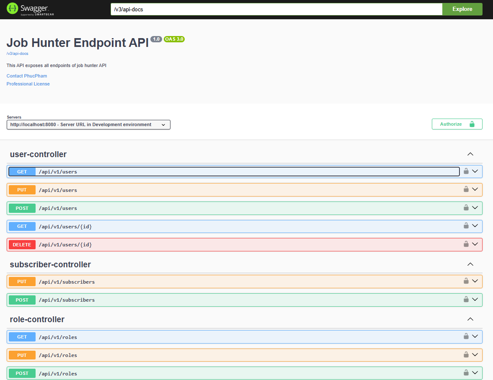
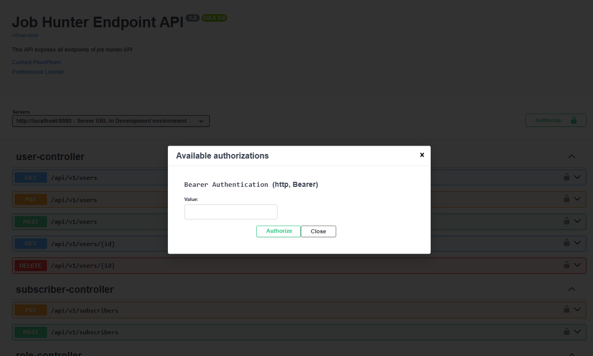

# JobHunter - Job Search Platform

## Introduction
**JobHunter** is a job-hunting web application designed with **Domain-Driven Design (DDD)** principles. The project simulates a real-world job portal, built using **Java Spring Boot (v3.2.4)** and **MySQL** for database storage, with **Spring Security (v2.5.7)** for authentication and authorization.

# Project Structure

This project follows **Domain-Driven Design (DDD)** principles to ensure a clean and maintainable architecture. Below is an explanation of each folder and its purpose.

## Folder Structure

```
├───config
├───controller
├───domain
│   ├───request
│   └───response
│       ├───email
│       ├───file
│       ├───job
│       └───resume
├───repository
├───service
└───util
    ├───annotation
    ├───constant
    └───error
```

## Folder Explanations

### 1. `config/`
- Contains configuration-related classes such as:
  - **Spring Boot configurations** (`@Configuration` classes).
  - **Security configurations** (e.g., JWT, OAuth).
  - **Database configurations** (e.g., DataSource, JPA).
  - **External API configurations** (if applicable).

### 2. `controller/`
- Contains **REST controllers** (`@RestController` or `@Controller`).
- Exposes API endpoints that handle HTTP requests.
- Uses **services** to process business logic.
- Example files:
  - `UserController.java` → Handles user-related API requests.
  - `AuthController.java` → Manages authentication.

### 3. `domain/`
- Represents the **business domain** of the application.
- Contains core models and logic.

#### `domain/request/`
- Holds **DTOs (Data Transfer Objects)** for incoming API requests.
- Used for **request validation and mapping**.
- Example:
  - `ResLoginDTO.java` (handles login payloads).

#### `domain/response/`
- Stores **DTOs for API responses**.
- Organizes response data into structured objects.
- Subfolders categorize response types:
  - **email/** → Response related to emails.
  - **file/** → Response for file uploads/downloads.
  - **job/** → Response for job-related APIs.
  - **resume/** → Response related to resumes.

### 4. `repository/`
- Contains **JPA repositories (`@Repository`)**.
- Interfaces extending `JpaRepository` or `CrudRepository` to interact with the database.
- Example:
  - `UserRepository.java` (handles user entity persistence).

### 5. `service/`
- Contains **business logic (`@Service`)**.
- Calls repositories to fetch/save data and controllers to return responses.
- Example:
  - `UserService.java` → Handles user authentication and registration.

### 6. `util/`
- Contains utility/helper classes used across the project.

#### `util/annotation/`
- Custom Java **annotations** (`@interface`).
- Example: `@CustomValidator` (for request validation).

#### `util/constant/`
- Stores **constant values** (e.g., error messages, role types).
- Example:
  - `ErrorMessages.java`
  - `ApplicationConstants.java`

#### `util/error/`
- Manages error handling, including:
  - **Custom exceptions** (`@ResponseStatus` annotations).
  - **Global exception handlers** (`@ControllerAdvice`).
- Example:
  - `GlobalExceptionHandler.java`
  - `CustomNotFoundException.java`

## Features
- **User Authentication & Management**:
  - Login and account creation
  - Role-based user management (Recruiters, Job Seekers)
  - Permissions for CRUD operations
- **Job Filtering**:
  - Search jobs based on criteria (salary, company, etc.)
- **Security & Authorization**:
  - OAuth 2.0-based authentication
  - JWT token-based authorization
  - Refresh token implementation
- **API Management**:
  - Global and local exception handling
  - API versioning support
  - Pagination & filtering for database queries
- **Email Notification System**:
  - Email service setup using Spring Email
- **Cron Job (exploration)**:
  - Cron multiple job from resources

---

## **Global API Response Format**
The project ensures structured API responses using a standardized response entity format.

## **Exception Handling**
- **Local Exception Handling**: Handled within the same file using `@ExceptionHandler`.
- **Global Exception Handling**: Managed via `@ControllerAdvice`.
- **Error Formatting**: Structured REST responses in `util.error`.

---

## **Authentication & Security**

### **OAuth 2.0 with JWT Authentication**
- **JWT Token Structure**: Header, Payload, Signature
- **Token Storage**: Saved securely in `SecurityContext`
- **Excluded Routes**: `login`, `create account`

### **Authentication Flow**
1. **User Input Validation**
   - Validate request payload (e.g., username, password)
   - Reference: [ResLoginDTO.java](https://github.com/phucpham24/RESTFull_java/blob/master/src/main/java/vn/backend/jobhunter/domain/response/ResLoginDTO.java)
2. **User Authentication**
   - Fetch user from the database
   - Verify hashed password using **BCryptPasswordEncoder**
3. **JWT Token Generation**
   - Secure key (`HS256`) stored in environment variables
   - Expiry: **1 day**
   - User roles & claims included
4. **User Response**
   - Password excluded from response
   - Includes JWT Token, user details, and expiry time
5. **Exception Handling**
   - `@ControllerAdvice + @ExceptionHandler`
   - Response codes: `401 Unauthorized`, `403 Forbidden`
6. **Endpoint Protection**
   - Secured routes require `Authorization: Bearer <JWT>`
   - Token validation & security context setup
7. **Refresh Tokens**
   - Stored securely in DB / HTTP-only cookies
   - Valid for **100 days**
   - Improves user experience when tokens expire

### **Token Usage & Authorization**
- **Access Token Validation**
  - Clients send the access token in request headers
  - Decoded before processing ([SecurityConfiguration.java#L42](https://github.com/phucpham24/RESTFull_java/blob/581754a011de9e7cac2b4f2f2357f5c2ebae5851/src/main/java/vn/backend/jobhunter/config/SecurityConfiguration.java#L42))
- **Handling Expired Tokens**
  - If expired, the client sends a refresh token for a new access token
  - Refresh token validation: ([SecurityUtil.java#L102](https://github.com/phucpham24/RESTFull_java/blob/581754a011de9e7cac2b4f2f2357f5c2ebae5851/src/main/java/vn/backend/jobhunter/util/SecurityUtil.java#L102))
- **Logout Mechanism**
  - API clears refresh token from DB & HTTP-only cookies
  - Response format:
    ```json
    {
        "statusCode": 200,
        "message": "Logout User",
        "data": null
    }
    ```
  - Logout API: [AuthController.java#L175](https://github.com/phucpham24/RESTFull_java/blob/ff6045c2cc53ab2cba20497d00a990a3cc6dff03/src/main/java/vn/backend/jobhunter/controller/AuthController.java#L175)

---

## **Database Interaction & Query Management**

### **1. Data Persistence & Formatting**
- Uses **Hibernate ORM** for database interaction
- `@PrePersist` ensures automatic formatting before saving
- Fields like `createdAt`, `updatedAt` handled automatically

### **2. Pagination & Filtering**
- Uses **Spring Data JPA**
- Pagination with `offset` & `limit`:
  - [ResultPaginationDTO.java](https://github.com/phucpham24/RESTFull_java/blob/master/src/main/java/vn/backend/jobhunter/domain/response/ResultPaginationDTO.java)
  - [Pagination Query Implementation](https://github.com/phucpham24/RESTFull_java/blob/22fe52ba95b727c137b06ca30e3f0f4a2347e7d2/src/main/java/vn/backend/jobhunter/service/UserService.java#L49)
- Dynamic filtering using **Spring Data Specifications**:
  - [Spring Filter JPA 3.1.7](https://www.baeldung.com/rest-api-search-language-spring-data-specifications)
  - **Criteria API & Predicate** for flexible queries

### **3. Custom Annotations & Messaging**
- `@ApiMessage` for structured API responses
- [Annotation Function](https://github.com/phucpham24/RESTFull_java/blob/master/src/main/java/vn/backend/jobhunter/util/annotation/ApiMessage.java)
- [Testing Annotations](https://github.com/phucpham24/RESTFull_java/blob/0978ede89499aea3907eb3cbb41adc6797b05f9a/src/main/java/vn/backend/jobhunter/controller/AuthController.java#L102)

### **4. API Versioning**
- Implemented for backward compatibility
- [Spring API Versioning](https://github.com/lkqm/spring-api-versioning)
- Example: [Versioning via Controller](https://github.com/phucpham24/RESTFull_java/blob/0978ede89499aea3907eb3cbb41adc6797b05f9a/src/main/java/vn/backend/jobhunter/controller/AuthController.java#L34)

---

## **Email Notification System**
- Uses **Spring Email** for sending emails to subscribers.
- Queries job data from the database based on the skills they have subscribed to.
- Sends formatted emails using an HTML template.
- Asynchronous processing to optimize performance, as loading email templates with CSS takes time.

## Configuration
The email service is configured in [`application.properties`](https://github.com/phucpham24/RESTFull_java/blob/ff6045c2cc53ab2cba20497d00a990a3cc6dff03/src/main/resources/application.properties#L46).


### Email Sending Service
Job data is queried from the database based on the subscriber's registered skills. The data is then sent to the email service, which processes the emails asynchronously to handle template rendering efficiently. The service implementation can be found in [`EmailService.java`](https://github.com/phucpham24/RESTFull_java/blob/6d804001bdfacc98f2f8e69740082d02566022c0/src/main/java/vn/backend/jobhunter/service/EmailService.java#L63).

### Email Template
The system uses an HTML template to format job notifications. The template can be customized in [`job.html`](https://github.com/phucpham24/RESTFull_java/blob/master/src/main/resources/templates/job.html).

- References:
  - [Spring Email Documentation](https://docs.spring.io/spring-framework/reference/integration/email.html)
  - [Baeldung: Sending Emails with Spring Boot](https://www.baeldung.com/spring-email)

---

## API Documentation with Swagger
### Swagger Configuration
- Allow access through Spring Security: [`SecurityConfiguration.java`](https://github.com/phucpham24/RESTFull_java/blob/6d804001bdfacc98f2f8e69740082d02566022c0/src/main/java/vn/backend/jobhunter/config/SecurityConfiguration.java#L90).
- OpenAPI configuration template: [`OpenAPIConfig.java`](https://github.com/phucpham24/RESTFull_java/blob/master/src/main/java/vn/backend/jobhunter/config/OpenAPIConfig.java).



### References
- [SpringDoc OpenAPI Properties](https://springdoc.org/#springdoc-openapi-core-properties)
- [Spring Boot Swagger 3 - Bezkoder](https://www.bezkoder.com/spring-boot-swagger-3/)
- [Spring Boot Swagger with JWT - Baeldung](https://www.baeldung.com/spring-boot-swagger-jwt)
  
---

## File Upload Service

- This is a simple file upload service built with Java Spring Boot. The service allows uploading files to a specific folder, ensuring that the file meets validation criteria such as file size and extensions.

### Logic flow

- Upload files via `multipart/form-data`
- Save files in a structured folder hierarchy based on feature names
- Validate uploaded files:
  - Ensure the file is not empty
  - Validate allowed file extensions
  - Enforce a maximum file size of 5MB
- Return the uploaded file name upon success
[link](https://github.com/phucpham24/RESTFull_java/blob/6d804001bdfacc98f2f8e69740082d02566022c0/src/main/java/vn/backend/jobhunter/controller/FileController.java#L44)

### References
https://spring.io/guides/gs/uploading-files
https://www.bezkoder.com/spring-boot-file-upload/

---

## **Data Model**


---


## **References & External Links**
- [CriteriaBuilder Documentation](https://docs.oracle.com/javaee/7/api/javax/persistence/criteria/CriteriaBuilder.html)
- [Creating Custom Annotations](https://www.geeksforgeeks.org/java-retention-annotations/)
- [Spring ResponseCookie Documentation](https://docs.spring.io/spring-framework/docs/current/javadoc-api/org/springframework/http/ResponseCookie.html)
- [Refactor Cookie Handling](https://reflectoring.io/spring-boot-cookies/)


